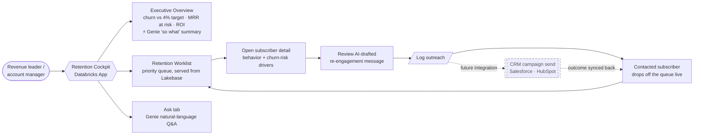
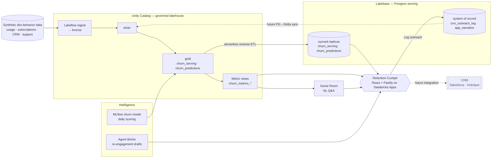

# Diagrams — for the pitch deck

Two slide-ready diagrams for the Retention Cockpit build. Both are authored in Mermaid
(left-to-right so they fit a 16:9 slide) with short labels kept large and legible.

**To put them on a slide:** paste a block into <https://mermaid.live>, export **SVG**
(crisp at any size) or PNG at ≥ 2× scale, and drop it onto the slide. Rendered copies
live alongside this file (`process-flow.svg`, `architecture.svg`). Keep labels short —
if a slide needs even less, cut the third line of a node, not the font size.

---

## 1. Process flow — how a user interacts with the app

The revenue team's journey through the cockpit, and the retention loop that closes when
outreach is logged. The dotted branch is the **future CRM integration** (not built).

**Read it as:** monitor (Overview) → act (Worklist → detail → AI draft → *Log outreach*)
→ the contacted user disappears from the queue immediately (the closed loop) → ask
(Genie). Today "Log outreach" writes to the governed log; **tomorrow** it hands off to
the CRM, which sends the campaign and syncs the outcome back.

---

## 2. Architecture — Databricks components

The six-stage journey wired end to end, plus the operational closed loop. Dotted edges
are future integrations.

**Stage mapping:** Lakeflow (ingest → bronze) · Unity Catalog (bronze→silver→gold +
metric views) · Lakebase (synced serving replicas + native system-of-record tables) ·
ML/Gen AI (MLflow daily scoring + Agent Bricks drafts) · Genie Room (NL Q&A over the
metric views) · Databricks App (the cockpit). Governed metric views are the single
semantic layer the app **and** Genie read, so their numbers can't diverge. The app
writes outreach to Lakebase (system of record); the dotted edges are the follow-ups
(PG→Delta outreach sync, and the CRM hand-off).
